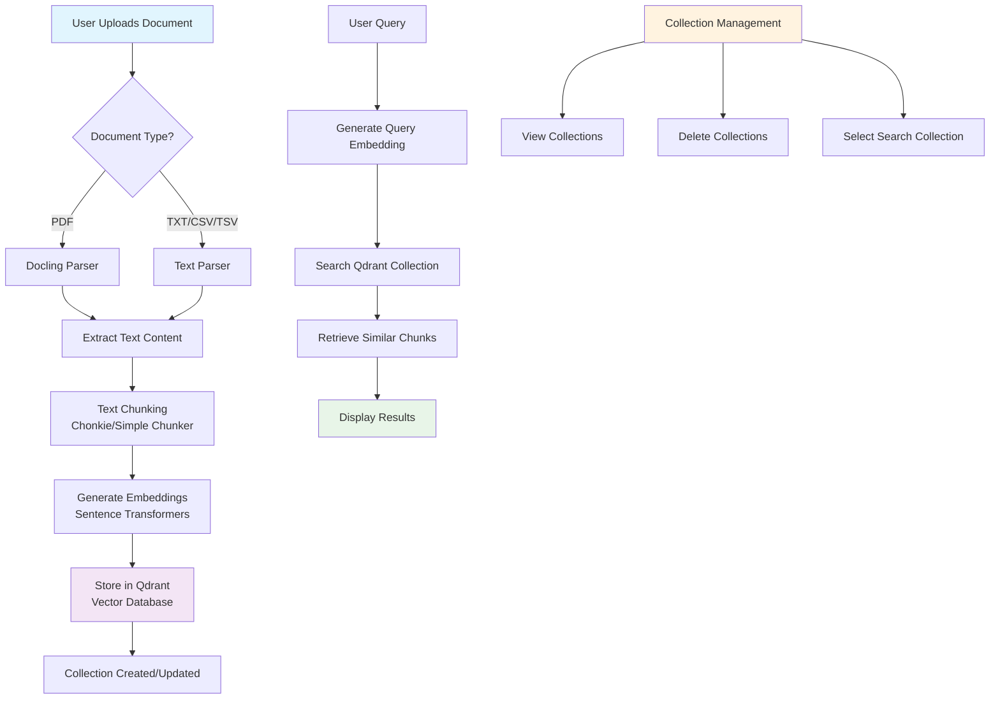

# 📄 Document Navigator

A powerful Streamlit-based application for document processing, embedding, and semantic search using Qdrant vector database. Upload PDFs, text files, CSV/TSV files, parse them with advanced document processing libraries, chunk the content, create embeddings, and perform semantic search queries.

## ✨ Features

- **Multi-format Document Support**: PDF, TXT, CSV, TSV files
- **Advanced Document Parsing**: Uses Docling for PDF parsing with pdfplumber fallback
- **Intelligent Text Chunking**: Chonkie-based chunking with semantic awareness
- **Local Embeddings**: Sentence-transformers for privacy-preserving embeddings
- **Vector Database Integration**: Qdrant for efficient similarity search
- **Collection Management**: Create, manage, and delete document collections
- **Interactive Search Interface**: Real-time semantic search with result visualization
- **Modern UI**: Clean, Amazon-inspired interface with responsive design

## 🛠️ Requirements

### System Requirements
- Python 3.8 or higher
- 4GB+ RAM (recommended for embedding models)
- Internet connection (for downloading embedding models)

### Python Dependencies

#### Core Dependencies
```bash
pip install streamlit
pip install qdrant-client
pip install sentence-transformers
```

#### Document Processing (Optional but Recommended)
```bash
pip install docling          # Advanced PDF parsing
pip install chonkie          # Intelligent text chunking
pip install pdfplumber       # PDF parsing fallback
```

#### Additional Dependencies
```bash
pip install pandas           # Data manipulation
pip install numpy            # Numerical operations
```

### Complete Installation
```bash
pip install streamlit qdrant-client sentence-transformers docling chonkie pdfplumber pandas numpy
```

### Environment Variables (Optional)
```bash
export QDRANT_HOST="localhost"           # Qdrant host (default: localhost)
export QDRANT_PORT="6333"               # Qdrant port (default: 6333)
export QDRANT_API_KEY=""                # Qdrant API key (if using Qdrant Cloud)
export QDRANT_COLLECTION="documents"    # Default collection name
export EMBED_MODEL="all-MiniLM-L6-v2"   # Embedding model name
```

## 🚀 Quick Start

### 1. Start Qdrant Database
```bash
# Using Docker (recommended)
docker run -p 6333:6333 -p 6334:6334 -it qdrant/qdrant

# Or install Qdrant locally
# See: https://qdrant.tech/documentation/quick-start/
```

### 2. Run the Application
```bash
streamlit run app.py
```

### 3. Access the Interface
Open your browser to `http://localhost:8501`

## 📊 Program Flow Diagram



## 📖 How to Use

### 1. Collection Management

#### View Collections
- The application automatically displays all available collections in a dropdown
- Collections are fetched from your Qdrant instance on startup

#### Delete Collections
1. Select a collection from the dropdown
2. Click "🗑️ Delete Collection"
3. Confirm deletion by clicking the button again
4. The collection and all its data will be permanently removed

### 2. Document Upload and Processing

#### Upload Documents
1. Click "Browse files" in the upload section
2. Select PDF, TXT, CSV, or TSV files
3. Choose a collection name (defaults to selected collection or sidebar setting)
4. Click "Parse & Index file into Qdrant"

#### Supported File Types
- **PDF**: Parsed using Docling (with pdfplumber fallback)
- **TXT**: Plain text files, chunked intelligently
- **CSV/TSV**: Each row becomes a searchable chunk with metadata

#### Processing Pipeline
1. **Parsing**: Extract text content from documents
2. **Chunking**: Split text into semantic chunks (500 tokens, 50 overlap)
3. **Embedding**: Generate vector embeddings using sentence-transformers
4. **Storage**: Store chunks and embeddings in Qdrant collection

### 3. Semantic Search

#### Search Interface
- Available only when collections exist
- Independent of file uploads
- Defaults to recently uploaded collection

#### Performing Searches
1. Select target collection from search dropdown
2. Enter your question in the text input
3. Click "Search & Retrieve"
4. View ranked results with similarity scores

#### Search Results
- **Ranked Results**: Top-K most similar chunks
- **Similarity Scores**: Cosine similarity scores
- **Metadata Display**: Source information and chunk details
- **Combined Context**: All results combined for comprehensive view

### 4. Configuration

#### Sidebar Settings
- **Qdrant Host/Port**: Database connection settings
- **Collection Name**: Default collection for new uploads
- **Embedding Model**: Sentence-transformer model selection
- **Top K Results**: Number of search results to display

#### Advanced Configuration
- Modify embedding model in sidebar
- Adjust chunk size and overlap in code
- Configure Qdrant connection parameters

## 🔧 Technical Architecture

### Document Processing Pipeline
1. **Input Validation**: File type detection and validation
2. **Content Extraction**: 
   - PDF: Docling → pdfplumber fallback
   - Text: Direct processing
   - CSV/TSV: Row-based chunking
3. **Text Chunking**: Semantic-aware splitting with overlap
4. **Embedding Generation**: Local sentence-transformer models
5. **Vector Storage**: Qdrant collection management

### Search Architecture
1. **Query Processing**: Text input validation
2. **Embedding Generation**: Same model as documents
3. **Vector Search**: Cosine similarity in Qdrant
4. **Result Ranking**: Score-based ordering
5. **Presentation**: Formatted results with metadata

### Data Flow
```
Document → Parse → Chunk → Embed → Store → Search → Retrieve → Display
```

## 🎯 Use Cases

- **Research**: Index academic papers and research documents
- **Knowledge Base**: Build searchable documentation systems
- **Content Analysis**: Analyze large text corpora
- **Question Answering**: Create RAG (Retrieval-Augmented Generation) systems
- **Document Management**: Organize and search through document collections

## 🔍 Troubleshooting

### Common Issues

#### Qdrant Connection Errors
- Verify Qdrant is running: `docker ps` or check Qdrant status
- Check host/port settings in sidebar
- Ensure firewall allows connections

#### Embedding Model Issues
- First run downloads models (may take time)
- Check internet connection for model downloads
- Verify sentence-transformers installation

#### Document Parsing Failures
- PDF parsing: Try different PDF files, check if scanned
- Large files: Consider memory limitations
- Unsupported formats: Check file type compatibility

#### Performance Issues
- Large documents: Increase system memory
- Slow embeddings: Use smaller embedding models
- Search latency: Optimize Qdrant configuration

### Getting Help
- Check Qdrant logs: `docker logs <container_id>`
- Verify Python dependencies: `pip list`
- Test Qdrant connection: Visit `http://localhost:6333/dashboard`

## 🚀 Advanced Features

### Custom Embedding Models
Modify the `EMBEDDING_MODEL_NAME` in sidebar or environment variables:
- `all-MiniLM-L6-v2` (default, fast)
- `all-mpnet-base-v2` (better quality)
- `paraphrase-multilingual-MiniLM-L12-v2` (multilingual)

### Collection Strategies
- **Single Collection**: All documents in one collection
- **Topic-based**: Separate collections per topic
- **Time-based**: Collections by date/period
- **Source-based**: Collections by document source

### Integration Options
- **API Integration**: Extend with REST API endpoints
- **Batch Processing**: Process multiple documents
- **Custom Chunkers**: Implement domain-specific chunking
- **LLM Integration**: Add answer generation capabilities

## 📝 Notes and Limitations

### Current Limitations
- Embeddings generated locally (no cloud APIs)
- No OCR support for scanned PDFs
- Single embedding model per session
- No document versioning

### Optional Improvements
- Add OCR support for scanned documents
- Implement document versioning
- Add batch upload capabilities
- Integrate LLM for answer generation
- Add document preview functionality
- Implement user authentication

## 🤝 Contributing

This application demonstrates a complete RAG pipeline using modern tools:
- **Docling**: Advanced document parsing
- **Chonkie**: Intelligent text chunking  
- **Sentence-transformers**: Local embedding generation
- **Qdrant**: Vector database for similarity search
- **Streamlit**: Interactive web interface

The codebase includes robust fallbacks and error handling, making it suitable for production use with appropriate modifications.

## 📄 License

This project is open source and available under the MIT License.

---

**Document Navigator** - Transform your documents into searchable knowledge with the power of vector embeddings and semantic search.